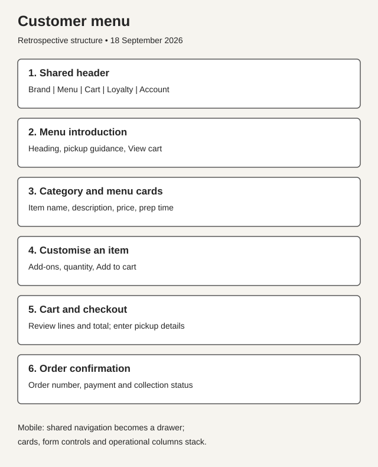
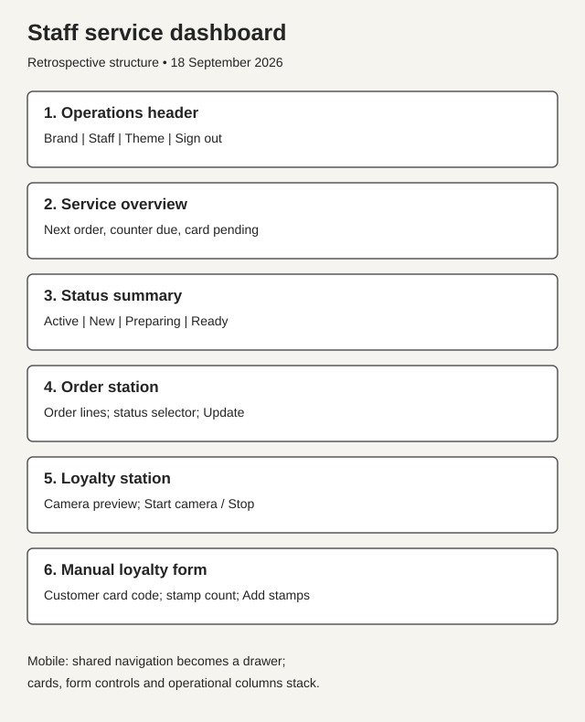
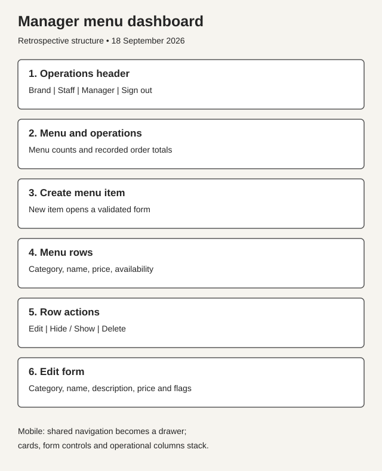
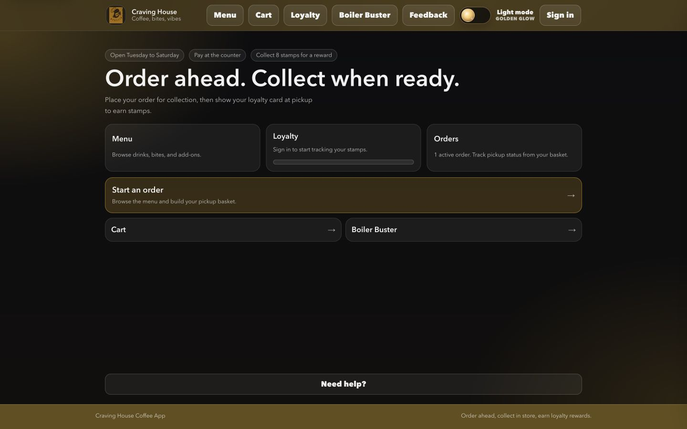
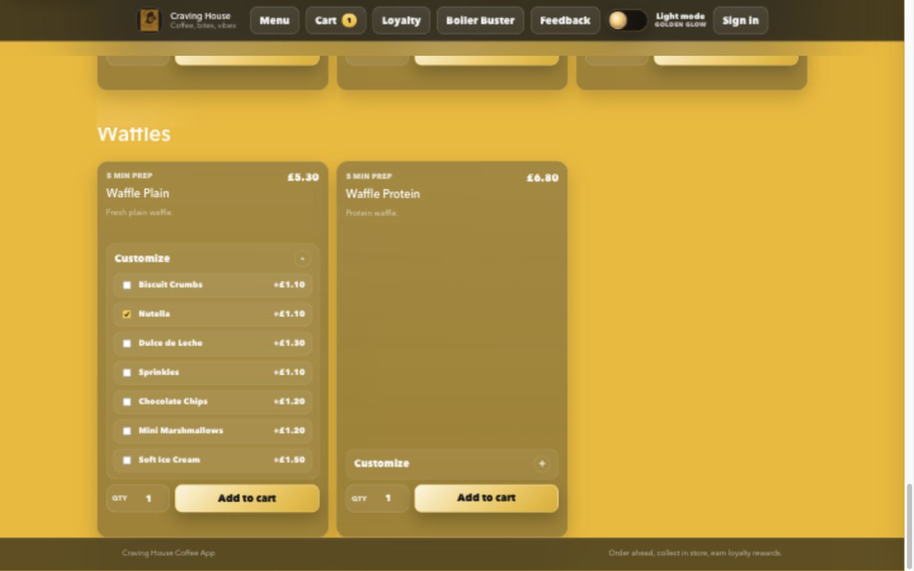
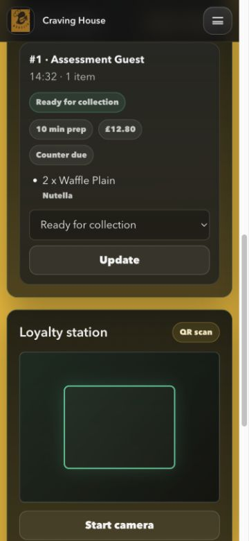

# Craving House Coffee App

**Project 4 — Full Stack Frameworks with Django**

[Live application](https://craving-house-app.onrender.com) · [GitHub repository](https://github.com/McauleeMaddison/Craving-House)

## Project Overview

Craving House is a Python and Django application for a coffee shop. Customers browse food and drinks, customise items, place pickup orders, collect loyalty stamps and send feedback. Staff manage the order queue and award stamps; managers maintain the menu. Boiler Buster gives customers a short game to play while waiting.

The project demonstrates both sides of a full-stack application: responsive HTML templates, CSS and JavaScript provide the interface, while Django routes, views, forms, authentication and the ORM handle requests and persist data. The cart belongs to the browser session; completed orders, menu data, feedback and loyalty records belong to the database. Pages render on the server, with JavaScript enhancements for navigation, themes, cart feedback, camera scanning and the game.

This documentation describes the implementation in this repository. Local evidence was collected on **17–18 September 2026**. Separate Stripe **Sandbox** checks were performed through the Render deployment on 17 September; no real card was charged. The learner identifies the course as the **Level 4 Diploma in Web Application Development, provided by Code Institute and assessed by Newcastle College**. The exact assessment brief has not yet been supplied, so no claim of official rubric compliance or assessor approval is made.

## Contents

- [User experience](#user-experience) and [user stories](#user-stories)
- [Design and wireframes](#design), [front-end design](#front-end-design), [features](#front-end-features) and [responsive design](#responsive-design)
- [Full-stack integration](#full-stack-integration)
- [Screenshot evidence](#frontend-screenshot-evidence)
- [Front-end testing](#front-end-testing), [automated testing](#automated-testing) and [validation](#validation--code-quality)
- [Known issues / bugs fixed](#known-issues--bugs-fixed)
- [Database and backend](#database--backend)
- [Setup](#setup), [assessor access](#assessor-test-access), [payment testing](#payment-testing) and [deployment](#deployment-notes)

## Technology Stack

- Python 3.9+
- Django 4.2
- SQLite for local development
- Django templates for server-rendered pages
- Django forms for validation
- Django ORM for database models and queries
- Django authentication and admin
- Django test runner for quality checks

## Main Features

- Customer menu browsing with prices, prep times, and item availability
- Item customisation for add-ons such as waffle toppings, hot dog toppings, and meal sides
- Session-based cart for pickup orders
- Checkout flow for Stripe test card payment or counter payment
- Private order confirmation pages with lookup codes
- Staff dashboard for viewing and updating active orders (refresh to obtain new orders)
- Digital loyalty card with staff stamp scanning
- Interactive Boiler Buster pressure-control mini game
- Customer feedback form saved to the database
- Manager dashboard for creating, editing, showing, and hiding menu items
- Django admin for full data management

## Project Structure

- `manage.py` - Django command-line entry point
- `craving_house/` - Django project settings, root URLs, ASGI, and WSGI config
- `cafe/` - main application code, including models, forms, views, admin, tests, and demo seed command
- `templates/` - Django HTML templates
- `static/django/` - application CSS and JavaScript
- `images/` - Craving House brand assets served as static files
- `requirements.txt` - Python dependencies
- `.env` - optional private local configuration; not loaded automatically or committed; production values are configured in Render

## Required Stack Evidence

- `manage.py` starts and manages the Django application.
- `craving_house/settings.py` configures the Django project.
- `cafe/models.py` defines the database schema using the Django ORM.
- `cafe/views.py` handles customer, staff, manager, and loyalty workflows.
- `cafe/payments.py` creates Stripe Checkout sessions for test card payments.
- `templates/` contains server-rendered Django pages.
- `static/django/js/clicker.js` powers the interactive Boiler Buster game.
- `cafe/tests.py` verifies ordering and access-control behaviour.
- `requirements.txt` lists Django as the application dependency.

## User Experience

| User group | Purpose and journey |
| --- | --- |
| Guest/customer | Start from the home page, browse the menu, choose quantity/add-ons, review the cart and place a counter-payment order without creating an account. Keep the confirmation URL to check its status. Guests can submit feedback and play Boiler Buster. |
| Registered customer | Sign in to see a named welcome, personal loyalty card and the eight most recent orders placed while signed in. Feedback uses the account email. Signup creates a loyalty profile and signs the customer in. |
| Staff | Signing in redirects the home route to the service dashboard. Staff see the oldest active order first, payment indicators, status controls and a loyalty station with manual code entry and optional camera scanning. |
| Manager/admin | Managers land on the menu dashboard, can create/edit/delete items and change availability, and can access the staff portal. Django admin is a separate interface controlled by Django staff status and model permissions; the seeded manager is a superuser. |

The shared navigation adapts to these roles. Staff and managers receive a **Portal** drawer and operational links instead of customer shopping links. Hiding links is a presentation choice; decorators in `cafe/views.py` enforce access on the server as well.

## User Stories

The ten stories below are tied to the actual models in [cafe/models.py](cafe/models.py). Django's built-in `User` supplies authentication; the cart uses the session, and Boiler Buster uses browser state rather than an invented database model.

| ID | User story | Models / storage | Acceptance evidence |
| --- | --- | --- | --- |
| ST01 | As a customer, I want to browse categories and menu items, so that I can choose what to order. | `MenuCategory`, `MenuItem` | US01; M02; menu screenshots |
| ST02 | As a customer, I want to choose add-ons and adjust my basket, so that the order matches my preferences. | `MenuItem`, `MenuItemAddOn`; session cart | US02–04; M03–07; add-on and cart tests |
| ST03 | As a customer, I want to place a pickup order and choose counter or card payment, so that I know what to collect and pay. | `Order`, `OrderItem` | US05–07; M08–11; F03 Stripe sandbox checks |
| ST04 | As a customer, I want to create an account and see my recent orders, so that I can return to their tracking pages. | Django `User`, `CustomerProfile`, `Order`, `OrderItem` | US08–09, US17; F01–02; history ownership tests |
| ST05 | As a customer, I want to see my loyalty card and stamp progress, so that I know when I have earned a reward. | `CustomerProfile` | US10; M15; eight-stamp boundary test |
| ST06 | As a staff member, I want to scan or enter a card code and award stamps, so that purchases are recorded in the customer's loyalty progress. | `CustomerProfile`, `LoyaltyScan` | US11; M18; manual-entry evidence; physical scan pending |
| ST07 | As a customer, I want to submit a rating and message, so that the café can review my experience. | `Feedback` | US12; M16; validation and email-storage tests |
| ST08 | As a customer, I want to play Boiler Buster while waiting, so that I have a short activity between ordering and collection. | Browser memory and local storage; no Django model | US13; M17; F04 keyboard win and persisted score; physical touch pending |
| ST09 | As a staff member, I want to view active orders and update their statuses, so that I can prioritise preparation and show collection progress. | `Order`, `OrderItem` | US14–15; M10/M18; queue and status tests |
| ST10 | As a manager, I want to maintain menu items and availability, so that customers see an accurate menu while staff retain service-only access. | `MenuCategory`, `MenuItem`, `MenuItemAddOn`; Django permissions | US16; M19; role tests. Item CRUD is in the manager portal; category/add-on administration uses Django admin permissions. |

### Detailed acceptance criteria

The detailed feature criteria below retain their original `US01–US17` evidence IDs so earlier test records remain traceable. The ten stories above group those features by user goal; these rows are acceptance criteria, not additional stories. `M` references the manual functional table below; `A` refers to the existing Django suite; `S` refers to the supplementary request checks. Screenshots are indexed in [docs/screenshots](docs/screenshots/README.md).

| Evidence ID | Feature | Acceptance criteria | How the application satisfies it / relevant feature | Testing evidence |
| --- | --- | --- | --- | --- |
| US01 | Browse menu | Categories contain item names, descriptions, prices and preparation times. | `/menu/` renders category and item cards from the ORM. Information appears on the card; there is no separate product-detail page. | M02; A menu test; screenshots 03–04 |
| US02 | Customise items | Available add-ons can be selected; their names and prices appear in the cart. | Native **Customize** disclosures and checkboxes submit add-on IDs. Django accepts only available add-ons belonging to that item. | M04; A add-on calculation test; screenshot 05 |
| US03 | Add to cart | Quantity is reflected in the cart and its navigation badge. | Menu POST forms are enhanced with `fetch`; the response updates badges without leaving the menu. | M03–04; A AJAX payload test |
| US04 | Update/remove cart lines | Update recalculates totals; Remove or quantity zero removes the line; an empty cart has a menu link. | `/cart/` posts to `update_cart`; summary values are recalculated from current menu data. | M05–07; S zero-removal check; screenshot 06 |
| US05 | Place a pickup order | Name is required; valid checkout creates an order with the selected items, total and prep estimate. | `CheckoutForm` validates details; `create_order_from_cart` stores order/item snapshots in a transaction. | M08–09; A checkout test; S invalid checkout; screenshots 07–08 |
| US06 | Counter payment | Confirmation states the amount due at collection and the cart is cleared. | Counter checkout stores payment method `counter` and status `due`. | M09–10; A counter-order assertions |
| US07 | Stripe checkout | Unconfigured card payment is disabled; configured checkout redirects to Stripe; a verified paid return updates the order. | `cafe/payments.py` creates/retrieves Checkout sessions; the confirmation view checks payment status and order reference. | M11; S unconfigured direct POST; A mocked Stripe tests. External sandbox decline and success verified; cancellation defect fixed locally (F03 below). |
| US08 | Account creation | Valid signup creates a user/profile and signs in; invalid input is rejected. | `/signup/` uses `SignUpForm`, based on Django `UserCreationForm`. | A signup test; M14; S signup validation; screenshot 16 |
| US09 | Sign in/out | Valid login shows the username; invalid login displays an error; sign out restores guest navigation. | Django authentication views plus a POST sign-out form in `base.html`. | M12–13, M20; screenshot 09 |
| US10 | Loyalty progress | The card shows a code/QR, current stamps out of eight and rewards available. | `/loyalty/` renders the profile, locally generated QR SVG and eight stamp positions. | M15, M18; A loyalty rendering; S eight-stamp boundary; screenshots 10, 17 |
| US11 | Award loyalty stamps | Valid code and 1–8 stamps update the profile and create a scan record; invalid input is rejected. | Staff form posts to `/staff/loyalty/scan/`; camera decoding can fill the same code field. | M18; A scan record test; S invalid scans. Physical camera untested. |
| US12 | Submit feedback | Name/message and a rating of 1–5 are required; success is acknowledged. | `FeedbackForm` stores feedback; signed-in email comes from the account. Review is through Django admin. | M16; A guest/account email tests; S feedback validation; screenshot 11 |
| US13 | Boiler Buster | Start runs the timer/gauges; taps vent steam; the round can restart. | `/boiler-buster/` loads `clicker.js`; game state is in the browser and best score uses local storage. | M17; A page/legacy-route tests; screenshot 12 |
| US14 | Incoming order queue | Active orders appear oldest first with item/add-on and payment information; collected/cancelled orders are excluded. | `/staff/` queries active orders and renders the next-order card, counts and order station. Refresh to obtain new orders. | M18; A ordering/statistics tests; screenshot 13 |
| US15 | Order status updates | A valid status persists and appears on the customer's confirmation after reload; invalid statuses are rejected. | Staff POST updates `Order.status`; both interfaces read the same record. | M18; S status checks; screenshots 08, 14 |
| US16 | Manage menu | New/edit saves fields; Hide disables ordering; Show restores availability; deletion is restricted to managers. | `/manager/` links to `MenuItemForm` and POST toggle/delete routes. Hidden items remain visible as unavailable cards. | M19; A manager access/deletion tests; S form checks; screenshot 15 |
| US17 | Personal order history | Only my eight most recent signed-in orders appear, with statuses and tracking links. | `/orders/` filters by `request.user`, orders newest first and limits the queryset to eight. | A history ownership, limit and checkout-linkage tests; F02 browser history evidence. |

## Design

These **retrospective structural wireframes** were created on 18 September 2026 from the implemented templates. They explain the design; they are not claimed as original pre-development artefacts or test screenshots. Actual rendered screens are separately indexed in [screenshot evidence](docs/screenshots/README.md).

### Customer view

The customer journey places menu information and ordering controls together, followed by cart review, checkout and a persistent order confirmation. Categories organise browsing; the basket shows add-ons and totals before submission.



### Staff view

The staff dashboard prioritises the next order, queue counts and order status changes. A separate loyalty station keeps camera and manual code entry beside the operational workflow. At narrow widths the stations stack.



### Manager view

Managers see menu counts and product rows with create, edit and availability actions. Forms expose the saved menu fields; service operations remain accessible through the Staff link.



### Why staff and manager roles are separate

Staff need to prepare orders, update collection status and award stamps. Managers additionally need to change menu records, prices and availability. This split limits routine service accounts to their operational duties and reduces accidental changes to the catalogue. Managers inherit staff access so they can cover service. [Role predicates](cafe/roles.py) and server-side view decorators enforce the distinction; hiding links alone is not security. Django admin access still depends on Django staff status and model permissions.

## Front-End Design

The working interface uses [base.html](templates/cafe/base.html), the page templates under `templates/cafe/` and `templates/registration/`, [app.css](static/django/css/app.css), [app.js](static/django/js/app.js) and [clicker.js](static/django/js/clicker.js). `static/html/index.html`, `static/css/style.css` and `static/js/script.js` provide a separate static project launcher; they are not the Django customer interface.

- **Layout and hierarchy:** a shared header, main landmark and footer frame each page. The home page uses action cards and a prominent **Start an order** link. Menu category headings organise item cards. Checkout separates the form from the order summary; staff separate order and loyalty stations; managers use product rows with adjacent actions.
- **Branding and colour:** the existing `images/ch-logo.png` appears in the header and browser icons through the `brand/` static namespace. CSS variables define the gold accent (`#f2b705`), near-black (`#0b0d12`) surfaces, pale text, green success and pink/red danger colours. Gradients, rounded corners, shadows and pills repeat across components. A light/dark switch stores the preference as `cravingHouseTheme` in local storage.
- **Typography:** CSS declares Plus Jakarta Sans/Manrope/Avenir Next for body text and Sora/Avenir Next Demi Bold for display text, with system fallbacks. The base template does not download these fonts; actual typeface depends on what is installed. `clamp()` scales prominent headings, and muted text distinguishes explanations from actions.
- **Controls:** primary ordering actions use the gold accent; secondary navigation uses outlined/surface buttons. The control-height token is 44px. Menu forms group quantity, add-ons and the submit button. Disabled items display **Unavailable**. Manager deletion invokes a JavaScript confirmation dialog.
- **Forms and messages:** Django `form.as_p` renders labelled fields, help text and validation errors for signup, login, checkout, feedback and product editing. Menu quantity controls have descriptive hidden text. Successful actions and server errors appear in a shared polite live region. AJAX cart actions update button text and an item-specific status region.
- **Accessibility present:** `lang="en"`, viewport metadata, a skip-to-content link, semantic navigation/main/footer, visible keyboard focus rules, labelled theme switches, drawer expanded state, native buttons/checkboxes/disclosures, game progressbar values, and a CSS reduced-motion rule. These are implementation features, not a claim of WCAG compliance. See the limitations below for remaining gaps.

## Front-End Features

| Visible feature | Interaction and resulting behaviour | Django/backend connection |
| --- | --- | --- |
| Shared navigation and themes | Desktop links or a mobile drawer; overlay, close button and Escape close the drawer. Switch changes the theme and persists it across reloads. | Context processor provides role flags and cart count. Theme preference remains in the browser. |
| Home dashboard | Menu, loyalty, order/cart shortcuts and **Need help?** guide the next action. A signed-in profile supplies progress. | `home` redirects operational users to their portals. Its active-order count is shop-wide; the Orders widget links to the cart, not personal history. |
| Menu and customisation | Read descriptions/prices/prep times, open **Customize**, choose add-ons and quantity, then add to cart. | `menu` prefetches categories/items/add-ons; `add_to_cart` filters valid choices and updates the session. |
| Cart | See named add-ons, per-unit/line totals, quantity, prep estimate and total. Update, remove, add more or continue. | `cart_summary` prices available items/add-ons using database values. Quantity is capped at 20 per cart line. |
| Checkout and confirmation | Enter pickup details; choose counter payment or configured Stripe. Confirmation shows items, payment information and collection status. | Form validation precedes transactional order creation. The confirmation URL includes the order ID and an unguessable UUID lookup code. |
| Accounts and order history | Signup is linked from Sign in. Customer navigation adds **Orders** after login; history offers tracking links. | Django user/session authentication; history filters by account. Guest orders do not automatically become account history. |
| Loyalty | View QR/card code, eight stamp positions and reward count; show the card to staff. | `CustomerProfile` stores progress. Stamps are awarded explicitly by staff, not automatically by checkout. Every eight stamps converts into one reward. |
| Feedback | Guest email is optional; signed-in feedback displays the account email. Submission shows an acknowledgement. | `FeedbackForm` saves `Feedback`; signed-in submissions cannot override the saved account email via the posted field. |
| Boiler Buster | A 20-second pressure-control game with score, best, timer and streak displays. Tap/click to start and vent; restart after a round. | Django serves the page; JavaScript drives the game. The game's queue is simulated and does not change real orders, stamps or rewards. |
| Staff portal | Next order, status/payment counters, active order cards, status select and loyalty form. Optional camera controls decode a QR into the code field. | Staff-only views update orders and create loyalty audit records. Scanner uses `BarcodeDetector`, with bundled `jsQR` fallback. |
| Manager portal and admin | Menu totals, product list, New item, Edit, Hide/Show and Delete. | Manager-only CRUD views use `MenuItemForm`. Categories/add-ons and feedback review are available in Django admin with appropriate permissions. |

## Responsive Design

The responsive rules were inspected in `static/django/css/app.css`; viewport checks are recorded separately below.

| Range / breakpoint | Actual CSS behaviour |
| --- | --- |
| Desktop above 1180px | Menu uses three equal columns; desktop navigation is visible. Checkout and staff workspaces use multiple columns. |
| 861–1179px | Menu uses two columns. At 980px and above Boiler Buster places its instructions alongside the board. |
| 860px and below, including the tested 768px tablet width | Desktop navigation is hidden and the drawer toggle is shown. Menu, checkout, staff workspace, loyalty card, history, cart rows and manager rows stack into one column. |
| 720px and below | Smaller menu/card spacing and home controls; staff heading/actions stack. The game's statistics use two columns and its machine/tap area scales down. |
| 420px and below, including 375px | Narrower page gutters; header tagline and Menu text are hidden while the labelled 44px toggle remains. Drawer width is capped at `min(92vw, 380px)`; menu hero actions and home shortcut row stack. |
| 380px and below | Boiler Buster action buttons can take full width. |
| Reduced-motion preference | CSS animations/transitions are disabled; the game also reads reduced-motion/coarse-pointer preferences. |

`safe-area-inset` spacing supports narrow-screen headers/home content. Not every CSS selector represents a currently rendered component: older game styles remain in the stylesheet. No separate native mobile application is implemented.

## Full-Stack Integration

The usual path is **template/control → URL route → view → validation/business logic → session or ORM/database → HTML redirect/render or JSON → visible update**.

| Example | End-to-end implementation |
| --- | --- |
| Add a customised item | `menu.html` submits quantity/add-on IDs to `/cart/add/<item_id>/` → `add_to_cart` checks availability and valid add-on ownership → `cart.py` builds a key from item and sorted add-on IDs → Django session is saved → JSON updates navigation badges/status text. Without the enhancement, the form receives a redirect and success message. |
| Counter checkout | `checkout.html` posts to `/checkout/` → `CheckoutForm` validates → `transaction.atomic()` creates `Order` and `OrderItem` snapshots → totals/prep time are calculated → cart clears → UUID confirmation page renders the stored result. The local browser test produced two £6.40 customised waffles, £12.80 total and 10 minutes prep. |
| Loyalty stamps | Staff submits a UUID and count → `LoyaltyScanForm` validates → profile updates and a `LoyaltyScan` records staff/count → success message → customer reloads `/loyalty/` and sees the new progress. |
| Feedback | `feedback.html` posts rating/message → `FeedbackForm` validates → authenticated email is taken from `request.user` → `Feedback` saves → redirect displays acknowledgement. |
| Order status | Staff selects a permitted status → `/staff/orders/<pk>/status/` checks staff access and allowed choices → ORM saves the status → staff page refreshes; the customer confirmation reads the same status on reload. |

## Frontend Screenshot Evidence

The initial seventeen **real local browser captures** and subsequent evidence are indexed in [docs/screenshots/README.md](docs/screenshots/README.md), including all fifteen originally requested views plus signup and mobile loyalty after stamps. The original `images/` files are brand/print assets, not application testing screenshots.

Screenshots 01–17 show disposable demonstration data on the local server before the accessibility follow-up. Screenshot 18 records the Render app after a real Stripe Sandbox return. Wireframes are labelled separately and are not screenshots. They document captured states, not every step or every device. These are viewport captures; long pages need scrolling. Full-page capture was avoided because the capture tool included the off-screen navigation drawer in its output.







Follow-up evidence includes the external Stripe paid return and text snapshots for browser signup, signed-in order history, Safari and keyboard gameplay. Physical-camera QR scanning and touch-device evidence remain outstanding. Suggested filenames and instructions are in the screenshot checklist; no links point to missing images.

## Front-End Testing

### Test environment and evidence boundaries

Testing took place on **17 September 2026**, using Python **3.9.6**, Django **4.2.30** and the **Codex in-app browser** against `http://127.0.0.1:8765`. The browser tool did not report a product version. A fresh seeded SQLite database at `/tmp/craving-assessment.sqlite3` isolated browser orders, users and feedback from the repository's existing database. The local server explicitly had no Stripe key. That initial run made no production changes. A later 17 September follow-up created two clearly named test orders on Render: one paid using Stripe Sandbox, one with checkout closed without payment. No real payment or deployment was performed.

- **PASS — browser:** the listed action and visible result were exercised through browser controls. This is a bounded manual check performed with UI automation, not a reusable end-to-end test suite.
- **PASS — Django:** an assertion ran in a Django test; it does not prove browser rendering or JavaScript behaviour.
- **Layout check:** the page was loaded at the stated viewport and document width was measured. It does not establish visual perfection, touch usability or contrast compliance.
- **NOT TESTED:** no pass is claimed. Source inspection alone is not a functional pass.

Reproduction details and raw command output are in [docs/testing/README.md](docs/testing/README.md).

### Manual Functional Testing

| ID / Feature | Test performed | Expected result | Actual result | Status |
| --- | --- | --- | --- | --- |
| M01 Navigation/theme | Open mobile drawer; use theme switch; reload; switch back; press Escape; follow desktop Menu. | Drawer responds, preference survives reload and menu opens. | Expanded state changed; dark preference survived; Escape restored closed state; menu rendered. | PASS — browser |
| M02 Menu information | Open seeded menu at desktop/mobile widths. | Categorised names, descriptions, GBP prices and prep times. | Americano showed £3.10/2 minutes; waffle £5.30/5 minutes; category/card content rendered. | PASS — browser |
| M03 Add item | Add one Americano from menu. | Badge increments without leaving menu. | Button entered Adding state and cart badges became 1. | PASS — browser |
| M04 Customisation | Expand Waffle Plain; select Nutella +£1.10; add; open cart. | Add-on persists and unit total is £6.40. | Cart showed Nutella, £6.40 waffle and £9.50 including Americano. | PASS — browser |
| M05 Quantity | Change waffle quantity to 2 and submit Update. | Waffle line £12.80; combined total £15.90. | Updated total appeared; later checkout retained quantity 2. | PASS — browser |
| M06 Removal | Remove Americano. | Only two customised waffles remain. | Checkout showed £12.80 total and 10-minute prep estimate. | PASS — browser |
| M07 Empty cart | Visit cart after ordering, then request checkout. | Empty state; checkout redirects to menu. | “Your cart is empty”; checkout redirected with “Add an item before checking out.” | PASS — browser |
| M08 Checkout validation | Submit blank name; enter malformed email. | Invalid input blocks order submission. | Name `valueMissing` and email `typeMismatch` were true; stayed at checkout. Server rejection also verified in S. | PASS — browser + Django |
| M09 Counter order | Enter Assessment Guest and assessment@example.com; Pay at counter. | Confirmation contains items, total and payment due. | Order #1, two waffles with Nutella, £12.80 due, 10-minute prep; cart cleared. | PASS — browser |
| M10 Confirmation status | After staff update, reopen the order's UUID URL. | Updated collection status is visible. | “Ready for collection” replaced “Placed”. | PASS — browser |
| M11 Stripe configuration | Inspect checkout without key; separately POST Stripe in S. | Disabled card button; direct request rejected. | Disabled state/explanation observed; server created no order for unconfigured Stripe. Initial check only; external Sandbox success/decline subsequently passed in F03. | PASS — initial configuration check; see F03 for provider results |
| M12 Invalid login | Submit customer with incorrect password. | Login error; no authenticated session. | Django displayed the correct-username-and-password error. | PASS — browser |
| M13 Valid login | Sign in with seeded customer/staff/manager credentials. | Customer welcome and role-specific landing pages. | Customer home, Service dashboard and Menu and operations appeared respectively. | PASS — browser |
| M14 Signup | Submit empty form; inspect form at three widths. | Required username blocks submission. | Browser reported missing username. F01 later verified mismatch rejection and valid browser creation; other validation ran in Django tests. | PASS — browser for required input/mismatch/creation; Django for other validation |
| M15 Loyalty display | Open customer loyalty page before/after staff award. | QR/code, eight stamp positions and current count. | Initially 0/8; subsequently 3/8, with matching filled stamps. | PASS — browser |
| M16 Feedback | Submit empty name, then rating 6, then valid name/message/rating 5 while signed in. | Missing/out-of-range input rejected; valid feedback acknowledged. | Browser validity flags rejected invalid input; acknowledgement appeared; account email was displayed without an editable email field. | PASS — browser |
| M17 Boiler Buster | Start and tap; allow an unattended round to end; restart. | Timer/gauges respond and reset. | ROUND LIVE, Taps: 2, then BOILER TRIPPED; restart reset timer to 20s. F04 subsequently verified a keyboard win and persisted best score. | PASS — browser for listed controls |
| M18 Staff operations | Inspect incoming order; set Ready; submit invalid UUID then valid customer code with 3 stamps. | Order persists; invalid scan shows error; valid scan updates card. | Correct order/add-ons/payment shown; status confirmation, invalid-code error and stamp success message appeared; customer showed 3/8. | PASS — browser; camera NOT TESTED |
| M19 Manager menu | Create Assessment Cocoa £2.75; edit to £2.95; Hide; check menu; Show. | Changes save; hidden item cannot be ordered; Show restores availability. | Save messages and £2.95 row verified; menu showed disabled Unavailable; Show returned Available. Delete is covered by A, not this browser run. | PASS — browser |
| M20 Logout | Sign out through desktop and mobile portal navigation. | Guest state returns. | Sign in link returned and account welcome disappeared. | PASS — browser |

### Responsive Testing

Viewports: **375 × 812**, **768 × 900** and **1440 × 900 CSS pixels**. All rows below were actually loaded at all three sizes. [Raw measurements](docs/testing/responsive-observations.json) record `innerWidth` and document `scrollWidth`; a vertical scrollbar can reduce the latter by 15px. **L = PASS for no document-level horizontal overflow only.** It is deliberately narrower than a full responsive usability pass.

| Page/state | Mobile 375px | Tablet 768px | Desktop 1440px | Notes |
| --- | --- | --- | --- | --- |
| Home, guest | L | L | L | Mobile and desktop screenshots visually inspected; primary actions visible. |
| Menu, seeded | L | L | L | Mobile screenshot visually inspected; all categories rendered; exact column changes come from CSS inspection. |
| Cart, populated | L | L | L | Desktop capture inspected; mobile/tablet width checks only. |
| Checkout, populated | L | L | L | Desktop form/summary inspected; required-field browser test completed. |
| Login | L | L | L | Desktop capture; valid/invalid authentication tested separately. |
| Signup | L | L | L | Form loads at each width; native required-input check completed. |
| Loyalty, customer | L | L | L | Mobile card visually inspected after stamp award; code wraps and progress is visible. |
| Feedback, customer | L | L | L | Form loads at each width; valid/invalid submission checked on desktop. |
| Staff dashboard, active order | L | L | L | Desktop overview and mobile order station visually inspected. |
| Manager dashboard | L | L | L | Mobile stacked controls visually inspected; desktop capture supplied. |
| Manager new-item form | L | L | L | Width checks and native category-required validation completed. |

These checks used resized browser viewports, not physical phones/tablets. Portrait/landscape devices, zoom, long user-generated content and exhaustive keyboard/screen-reader traversal remain to be tested. Follow-up checks cover six customer pages in both themes at mobile width. The identified light-theme heading/card contrast was corrected; the conservative colour calculations below apply only to those pairs, not every element.

### Device and template coverage

`PASS — layout` means the template loaded without document-level horizontal overflow at the specified viewport, not a physical-device or complete accessibility pass. The [original measurements](docs/testing/responsive-observations.json) include these four templates and seven further pages. [Fresh measurements on 18 September](docs/testing/final-responsive-observations.json) rechecked all four templates at all three widths after the accessibility fixes.

| Device / viewport | Homepage `home.html` | Menu `menu.html` | Cart `cart.html` | Checkout `checkout.html` | Boundary |
| --- | --- | --- | --- | --- | --- |
| Desktop — 1440 × 900 | PASS — layout | PASS — layout | PASS — layout | PASS — layout | In-app browser; functional ordering tests recorded separately. |
| Tablet — 768 × 900 | PASS — layout | PASS — layout | PASS — layout | PASS — layout | Resized viewport, no physical tablet. |
| Mobile — 375 × 812 | PASS — layout | PASS — layout | PASS — layout | PASS — layout | Resized viewport, no physical phone or touch-input claim. |

### Browser Testing

The four requested browser products are listed explicitly. An unchecked row is an honest testing gap, not an implied pass. The in-app browser is recorded separately rather than being labelled Chrome, Safari, Firefox or Edge.

| Browser | Homepage | Menu | Cart | Checkout | Actual scope |
| --- | --- | --- | --- | --- | --- |
| [ ] Chrome | NOT TESTED | NOT TESTED | NOT TESTED | NOT TESTED | No independent Chrome run recorded. |
| [ ] Firefox | NOT TESTED | NOT TESTED | NOT TESTED | NOT TESTED | No independent Firefox run recorded. |
| [x] Safari 27.0 on macOS | PASS | PASS | PASS | PASS — display | Home/account navigation, menu Add to cart acknowledgement, £3.10 cart and checkout form/summary observed. Login, personal history, tracking and logout also exercised. Safari checkout submission was not tested. |
| [ ] Edge | NOT TESTED | NOT TESTED | NOT TESTED | NOT TESTED | No independent Edge run recorded. |
| [x] Codex in-app browser, version not reported | PASS | PASS | PASS | PASS | M01–M20 and F01–F04 within their stated limits; local counter checkout and deployed Stripe Sandbox success/decline. |

Safari's core-template checks were recorded on 18 September; its account/history checks were recorded on 17 September. See [Safari template evidence](docs/testing/safari-menu-cart-checkout.txt) and [history evidence](docs/testing/safari-order-history.txt). The QR fallback test in `cafe/tests.py` checks script text; it is **not** proof of cross-browser camera scanning.

### Follow-up functional evidence

| ID / Test | Steps | Expected | Actual | Pass-Fail |
| --- | --- | --- | --- | --- |
| F01 Browser signup | Submit mismatched passwords, then matching acceptable passwords with a unique username/email. | Error first; successful creation then authenticated loyalty page. | Mismatch error displayed; account created; loyalty card displayed 0/8. [Snapshot](docs/testing/signup-browser-snapshot.txt). | PASS |
| F02 Personal order history | Check a new account's empty history; order one Americano while signed in; return to Orders and open tracking. | Account's order appears; earlier guest order does not. | Order #2, £3.10, one Americano; guest order #1 absent. Also opened tracking in Safari. [Snapshot](docs/testing/order-history-browser-snapshot.txt). | PASS |
| F03 External Stripe | Open Render checkout; verify Sandbox; submit official decline card, then success card; separately use the provider's Back link. | Decline error; paid return; meaningful cancellation return. | Decline shown; £3.10 paid return confirmed. Cancellation returned to an empty menu: defect reproduced and fixed locally to retain order context. [Decline](docs/testing/stripe-decline-snapshot.txt), [success](docs/testing/stripe-success-snapshot.txt). | PASS success/decline; cancellation FIXED LOCALLY, deployment retest pending |
| F04 Full keyboard game | Start/restart; use Space to vent through a 20-second round; reload. | Queue clears, score persists. | Queue cleared; score/best 222; 76 vents; reload retained best 222. [Snapshot](docs/testing/game-keyboard-win.txt). | PASS |
| F05 Manual loyalty code | Enter the newly created customer's code and 1 stamp as staff. | Success acknowledgement and a stored scan. | “Added 1 stamp(s) to assessment_browser_0917.” This is manual entry, not proof of the camera-denial branch. | PASS — manual entry |

### Manual game and loyalty scanner checks

| Test | Steps | Expected | Actual | Pass-Fail |
| --- | --- | --- | --- | --- |
| Boiler Buster — mouse | Click Start, click the boiler, allow a loss, then restart. | Timer/gauges respond; taps counted; restart resets the round. | M17 recorded ROUND LIVE, Taps: 2, BOILER TRIPPED and reset to 20s. | PASS — mouse controls |
| Boiler Buster — keyboard | Focus game control; Enter/Space; keep venting; reload after a win. | Keyboard controls work; completed score persists. | F04 completed a 20-second round and retained best 222. | PASS |
| Boiler Buster — physical touch | On a phone/tablet, tap Start, repeatedly vent, then restart. Check one score increment per tap. | Touch events operate without duplicate clicks or scrolling interference. | No physical touch-device session performed. Viewport resizing is not a substitute. | NOT TESTED |
| QR scanner — permission prompt | Sign in as staff; choose Start camera on HTTPS or localhost. | Browser asks for camera permission where not already decided. | In-app attempt remained “Preparing camera scanner...”; no permission outcome verified. Safari prompt check remains deferred. | NOT VERIFIED |
| QR scanner — denied permission | Deny camera access, then read the status and enter a code manually. | “Camera permission was not granted. Enter the card code manually.”; manual submission remains usable. | Error text exists in `app.js`; actual deny-then-submit sequence not completed. | NOT TESTED |
| QR scanner — manual entry | Enter a valid customer code and 1–8 stamps; submit; reopen the card. | Success and updated stamp count; audit record created. | M18 verified 3/8 and F05 a further synthetic account's one-stamp acknowledgement; Django tests verify scan persistence and reward boundary. | PASS — independent manual path |
| QR scanner — physical scan | Allow camera; show a real display/printed QR; confirm code; add stamps; Stop. | Correct code decodes, stream stops and only an explicit submission awards stamps. | Deferred at the learner's request; no physical scan claimed. | NOT TESTED |

### Accessibility follow-up

The home title is now an `h1`; quantity/status controls and loyalty progress have accessible names; the drawer is inert and hidden while closed. Opening the mobile dialog moves focus to Close, makes the background inert and confines Tab/Shift+Tab; Escape closes it and restores focus to Open menu. These keyboard outcomes were exercised at 375px. Form rendering uses Django `as_div` to avoid paragraph/list nesting in signup help. The scanner status is a polite live region.

[axe-core 4.13.0 results](docs/testing/accessibility-audit.json) record the actual states scanned. No automatic violations were reported in the follow-up states, but many gradient contrast checks were marked **incomplete**. These results are not a claim of complete WCAG conformance. Initial semantic findings on labelled generic groups were subsequently corrected with explicit group roles; the later mobile scan records the retest. The staff video is a silent live camera preview, not prerecorded media requiring captions.

[Conservative colour calculations](docs/testing/contrast-results.json) for the corrected light-theme pairs: menu secondary text improved from **2.55:1 to 6.94:1**; heading text on gold improved from **1.75:1 to at least 5.88:1** across the specified background overlays. These checks do not cover every text/control state. Full screen-reader, zoom and remaining gradient/control contrast review are still outstanding. Focus management follows the [W3C modal-dialog pattern](https://www.w3.org/WAI/ARIA/apg/patterns/dialog-modal/).

### Form Validation Testing

The nine [supplementary checks](docs/testing/request_checks.py) exercise forms and server responses with isolated test data. `S` means these checks, which bypass browser-native validation intentionally. All listed S checks passed; exact assertions and output are linked rather than claiming blanket form coverage.

| Form | Valid input | Missing required input | Invalid input | Expected feedback and actual result |
| --- | --- | --- | --- | --- |
| Signup | Unique username, email and matching acceptable passwords valid in S; creation/profile/login verified in A and F01 browser signup. | Empty form invalid in S; empty username blocked in browser. | Bad email, mismatched/weak passwords and existing username rejected in S. | Django password mismatch text rendered; no user created by invalid POST. PASS for these cases. |
| Login | Seeded customer/staff/manager credentials accepted in browser. | Not separately submitted empty in browser. | Wrong password rejected in browser. | Correct-username-and-password error displayed. PASS for valid/incorrect-password cases; missing-input case NOT TESTED. |
| Checkout | Name-only form valid in S; browser guest checkout succeeded. Email/phone/notes optional. | No name rejected in S and browser. | Bad email rejected in S and browser. | Bound form errors returned; invalid POSTs created zero orders. PASS. |
| Feedback | Guest form valid in S; browser signed-in rating 5 succeeded; A verifies stored guest/account email. | Empty form invalid in S; name missing blocked in browser. | Email malformed, rating 0/6 and blank message rejected in S; rating 6 also blocked in browser. | Form errors returned and invalid POSTs created no Feedback rows. PASS. |
| Manager item | Category/name/description/£2.95/prep 5 accepted; browser create/edit succeeded. | Empty form invalid in S; browser required category blocked save. | Non-numeric price, negative prep, blank name and duplicate category/name rejected in S. | Bound form errors; no extra item saved. PASS for listed inputs. |
| Loyalty stamp | Valid card and 3 stamps succeeded in browser; 8 stamps converted to one reward in S. | Empty form invalid in S. | Malformed UUID, zero or nine stamps rejected in S; malformed UUID also submitted in browser. | Shared invalid-card/count error; invalid cases created no scan record. PASS. Unknown but well-formed UUID not included. |
| Staff order status | Ready succeeded in browser; Collected excluded the order from the queue in S. | No separate missing-status case. | Unknown status rejected in S. | “That order status is not valid”; original status unchanged. PASS for listed cases. |

### Acceptance Criteria Testing

| Evidence ID | Acceptance criteria checked | Test/evidence | Result |
| --- | --- | --- | --- |
| US01 | Item/category information renders | M02; A menu; 03–04 | PASS |
| US02 | Add-ons selected, priced and retained | M04; A add-ons; 05–06 | PASS |
| US03 | Add action updates session/badge | M03; A AJAX payload | PASS |
| US04 | Update/remove/empty state | M05–07; S quantity zero | PASS |
| US05 | Valid order persists; invalid input rejected | M08–09; A checkout; S checkout | PASS |
| US06 | Counter due confirmation and cleared cart | M07, M09; A checkout | PASS |
| US07 | Disabled when unconfigured; pending/paid provider responses | M11; S disabled POST; A mocks | PASS success/decline via F03; cancellation deployment retest pending |
| US08 | Account/profile creation and validation | A signup; S signup; M14 | PASS — Django plus F01 browser creation |
| US09 | Valid/invalid login and logout | M12–13, M20 | PASS |
| US10 | Stamp/reward progress | M15/M18; A QR/card; S eight-stamp conversion | PASS — reward boundary through Django |
| US11 | Staff award and rejection | M18; A scan audit; S invalid scans | PASS — manual code entry; camera NOT TESTED |
| US12 | Feedback validation/storage and acknowledgement | M16; A email storage; S invalid input | PASS |
| US13 | Start/tap/restart | M17; A page/redirect | PASS for mouse controls and F04 keyboard win/persistence; physical touch NOT TESTED |
| US14 | Incoming active queue and prioritisation | M18; A oldest-first/closed exclusion | PASS |
| US15 | Status changes shared with customer | M10/M18; S status | PASS |
| US16 | CRUD access and availability | M19; A deletion/access; S form | PASS — deletion through Django test client |
| US17 | Owned, limited recent history and tracking links | A order history and signed-in checkout | PASS — Django plus F02 browser history |

## Automated Testing

The final regression on **18 September 2026** ran the original 35 tests and nine supplementary checks together: **44 tests passed**, including the new cancellation assertions within existing payment tests. [Full output](docs/testing/final-regression.txt). Static collection also passed: **138 files copied, 404 post-processed**. [Output](docs/testing/final-collectstatic.txt).

The original [cafe/tests.py](cafe/tests.py) remains intact. Its **35 tests passed** with `OK` and Django reported **no system-check issues (0 silenced)**. See [system check output](docs/testing/django-check.txt) and [test output](docs/testing/django-tests.txt).

| Existing coverage | What the assertions establish |
| --- | --- |
| Menu/cart/add-ons | Menu content renders, AJAX add returns expected JSON, selected add-on names/prices appear and totals are correct. |
| Signup/authentication-related presentation | Account/profile creation, welcome username, guest navigation and role-specific portal links/redirects. The suite does not itself test bad login credentials. |
| Home/loyalty | Guest/untracked/tracked progress, eight stamp slots, QR markup, staff stamp updates and scan audit records. |
| Feedback | Guest email saves; signed-in form hides the email input and uses account email even if a different value is posted. |
| Checkout/payments | Counter order totals, prep time and add-on snapshots; mocked Stripe pending checkout/redirect and mocked paid confirmation. No card is charged. |
| History/status | Login requirement, ownership filtering, eight-order limit, signed-in checkout association, collected customer wording. |
| Permissions and staff/manager work | Customer denied staff access, Staff group denied manager access, manager dashboard/deletion, portal navigation and oldest-first staff queue statistics. |
| Static/game/health | Brand/static icon references, scanner fallback source strings, game page and legacy redirect, health JSON. These are not visual browser tests. |

The additional **nine assessment checks passed** with `OK`; see [their source](docs/testing/request_checks.py) and [raw output](docs/testing/request-checks.txt). They add targeted invalid-input/no-write checks, zero-quantity removal, incorrect order lookup, eight-stamp reward conversion, invalid/collected statuses, disabled Stripe POST and compilation of all 15 project templates. They run explicitly, separately from the original suite.

Re-run from an activated environment:

```bash
python3 manage.py check
python3 manage.py test
python3 manage.py test docs.testing.request_checks --verbosity 2
python3 manage.py collectstatic --noinput
```

`collectstatic` was run with a temporary `STATIC_ROOT`: **138 files copied, 404 post-processed**, exit 0. [Raw output](docs/testing/collectstatic.txt). The existing GitHub Django Quality workflow runs system checks, tests and static collection on relevant changes; it does not run a browser suite. No remote CI run is claimed here.

## Validation / Code Quality

| Check | Actual evidence |
| --- | --- |
| Django system check | PASS: zero issues. |
| Existing automated suite | PASS: 35 tests, OK. |
| Supplementary form/request/template checks | PASS: 9 tests, OK; all 15 templates compile. |
| HTML/template structure | Inspected semantic shell, form markup, CSRF tokens and browser-rendered pages. Template compilation is not HTML5 validation. No W3C/Nu HTML validator was run. |
| CSS | Inspected actual variables, responsive selectors and reduced-motion rules; rendered at three widths. No CSS validator or linter was run. |
| JavaScript | Exercised drawer/theme/cart/game controls in the browser; captured console query returned no warnings/errors. No ESLint or standalone JS syntax checker was run. Camera and gameplay branches are not exhaustively covered. |
| Static assets | PASS: WhiteNoise static collection/manifest processing completed with temporary output directory. |
| Whitespace and links | Final local `git diff --check` and repository Markdown target checks; see evidence notes. |

## Known Issues / Bugs Fixed

| Finding | Evidence / cause | Resolution and verification |
| --- | --- | --- |
| Home-page loyalty offer contradicted the actual eight-stamp scheme | `home.html` said “Buy 5 get 1 free”; `CustomerProfile.LOYALTY_STAMPS_REQUIRED` is 8 and the loyalty page renders eight positions. | Changed only that pill to “Collect 8 stamps for a reward”. Corrected text observed in the local browser at mobile/desktop sizes. Original suite passed; supplementary eight-stamp conversion check passed. No loyalty logic or data changed. |
| Hidden mobile drawer remained keyboard-focusable | Initial axe scan reported `aria-hidden-focus`; no focus trap/restoration existed. | Closed drawer now inert/hidden; dialog background inert while open. Tab wraps both ways; Escape restores the opener. Verified with browser keyboard actions. |
| Missing heading/control semantics | Home lead was a `div`; cart quantity/staff status and loyalty progress lacked names; labelled groups lacked roles. | Added `h1`, accessible names and group roles. Follow-up scans and DOM checks recorded. |
| Light-theme text was faint on gold | Menu secondary text calculated at 2.55:1; heading text at 1.75:1 for the specified colours. | Darkened affected card surfaces and used dark text for headings on gold. Calculated corrected ratios 6.94:1 and at least 5.88:1; browser view inspected. |
| Signup help contained block lists inside paragraphs | Django `as_p` wrapped password help containing a list. | Switched form rendering to `as_div`, retaining Django labels, help and validation. F01 signup and regression tests passed. |
| Stripe cancellation lost the order context | Actual Render Sandbox Back action returned to empty checkout, then menu with “Add an item before checking out.” | Cancel URL now returns to the existing UUID order page, clearly stating that payment is unconfirmed and advising staff contact before a duplicate order. The [44-test regression run](docs/testing/final-regression.txt) passed; cancellation assertions verify pending state stays pending and paid state cannot be undone by a query flag. **Local fix; deployed retest pending.** |

### Known issues and remaining verification

- The official Level 4 assessment brief/qualification code has not been supplied. The Newcastle College/Code Institute course description alone is insufficient for a criterion-by-criterion sign-off; no grade or assessor approval is guaranteed.
- Physical-camera QR scanning and the real permission-denial journey remain unverified. The in-app Start camera attempt remained at the preparation message; its cause has not been established. Manual entry passed independently.
- Physical touch gameplay, independent Chrome/Firefox/Edge runs, full screen-reader testing, zoom and remaining gradient/control contrast combinations remain unverified.
- Staff queues and customer status pages require a refresh; no polling/WebSocket push is implemented.
- A complete order ID/UUID URL acts as a private bearer link. It is not an account-only page.
- The manager's **recorded revenue** metric includes unpaid/cancelled orders and is not verified payment income.
- Loyalty counts are stored, but there is no customer-facing reward redemption workflow. Staff explicitly award stamps; checkout does not automatically award them.
- Stripe enablement uses a non-empty environment value, not enforced test-key validation. Use Sandbox for assessment. Payment confirmation is checked on return; no webhook is implemented, so a payment that never returns may remain pending. Cancelling checkout leaves a pending order; staff must resolve it. The local cancellation explanation does not claim to cancel a Stripe payment or offer a new retry flow.
- Local fixes and documentation must be reviewed and deployed together before comparing the submitted source with the live app. No deployment was performed by this review.
- The refreshed [submission ZIP](dist/craving-house-django-submission.zip) includes current source, documentation, wireframes and evidence. Its manifest is generated by [the build script](scripts/build_submission.py); it excludes secrets, databases and development environments. Packaging is not assessor sign-off.

## Database / Backend

### Data model

The schema is defined in [cafe/models.py](cafe/models.py) and versioned in `cafe/migrations/`. No schema changes were made for this documentation work.

| Model | Stored data and relationships |
| --- | --- |
| `MenuCategory` | Unique name/slug and display order; one category has many menu items. Category deletion is protected while referenced. |
| `MenuItem` | Category, name, description, decimal price, prep minutes, loyalty eligibility, availability and featured flag. Name is unique within a category. |
| `MenuItemAddOn` | Parent item, name, price, availability and display order; unique name per item. Add-ons are deleted with their menu item. |
| `CustomerProfile` | One-to-one Django User, UUID card code, phone, current stamps and rewards available. Eight stamps convert to one reward. |
| `Order` | Optional customer FK, guest contact/pickup details, UUID lookup code, order/payment statuses, Stripe session ID, subtotal and prep estimate. Deleting a user leaves the order with a null customer. |
| `OrderItem` | Belongs to an order; stores item name, add-on names/total, quantity, unit price and prep snapshot. Menu-item deletion nulls the FK and preserves historic order information. |
| `Feedback` | Name, optional email, validated 1–5 rating, message and timestamp. |
| `LoyaltyScan` | Links the profile and awarding staff user, count and time. Staff-user deletion is protected while audit records refer to that user. |

The session cart is a mapping of item/add-on keys to quantities rather than a separate Cart model. Current availability and prices are resolved by `cart_summary`; checkout snapshots them into persistent order lines. Monetary fields use decimal arithmetic. SQLite is the development default; settings select PostgreSQL with SSL when `DATABASE_URL` is present.

### Authentication, permissions and security

Django supplies password hashing/validators, sessions, authentication views and admin. `cafe/roles.py` recognises active users in **Staff** or **Manager** groups and Django staff/superuser flags. Staff access includes Managers; manager access requires the Manager group or superuser status. Membership in the Manager group alone does not grant arbitrary Django admin permissions.

Mutation controls use POST forms with CSRF tokens; dedicated cart/status/stamp/toggle/delete endpoints require POST. Django forms validate checkout, signup, feedback and product fields. Normal template values are escaped; the loyalty SVG is generated locally before being rendered as safe markup. Lookup UUIDs protect order URLs from simple sequential-ID guessing. Existing permission tests cover selected access paths, not every possible security condition.

Production settings support allowed hosts, trusted CSRF origins, secure cookies, HTTPS redirection, proxy HTTPS handling and HSTS. WhiteNoise serves collected static assets and Gunicorn runs WSGI. Credentials belong in environment variables, not tracked files. The settings read `os.environ`; the application does **not** automatically load a `.env` file.

## Setup

Create and activate a virtual environment:

```bash
python3 -m venv .venv
source .venv/bin/activate
```

Install dependencies:

```bash
python3 -m pip install -r requirements.txt
```

Create the local database:

```bash
python3 manage.py migrate
```

For a fresh development database, load demo menu data and test accounts. This command updates seeded menu values; use a disposable database for assessment tests:

```bash
python3 manage.py seed_demo
```

Start the development server:

```bash
python3 manage.py runserver
```

Open the application at:

```text
http://127.0.0.1:8000/
```

## Assessor Test Access

The seed command creates these demonstration accounts for assessment:

- Manager: `manager` / `ManagerPass123`
- Staff: `staff` / `StaffPass123`
- Customer: `customer` / `CustomerPass123`

The demo customer loyalty card code is:

```text
11111111-1111-4111-8111-111111111111
```

Public users can also create their own account from `/signup/` or the **Create an account** link on the sign-in page. After login, the navigation displays `Welcome, <username>` so assessors can confirm which account is active.

These credentials are for assessment only. Create new accounts and passwords before using the application in any real environment.

## Payment Testing

Stripe Checkout is supported when `STRIPE_SECRET_KEY` is configured with a Stripe test-mode secret key. The application redirects to Stripe Checkout and does not store card numbers.

Use these Stripe test card details in test mode:

```text
Card number: 4242 4242 4242 4242
Expiry: any future date, for example 12/34
CVC: any 3 digits, for example 123
Postcode: any valid postcode, for example SW1A 1AA
```

If `STRIPE_SECRET_KEY` is not set, the Stripe button is disabled and the assessor can still test the checkout workflow with **Pay at counter**. F03 used the official [Stripe testing guidance](https://docs.stripe.com/testing): `4000 0000 0000 0002` for a decline and `4242 4242 4242 4242` for success, only after the hosted page displayed **Sandbox**.

## Loyalty Scan Testing

To test staff loyalty scanning:

1. Sign in as staff with `staff` / `StaffPass123`.
2. Open `/staff/`.
3. Enter the demo customer card code `11111111-1111-4111-8111-111111111111`.
4. Enter a stamp count, for example `3`.
5. Submit **Add stamps**.
6. Sign in as customer with `customer` / `CustomerPass123` and open `/loyalty/` to confirm the stamps were added.

## Functional Acceptance Checklist

This table records actual evidence rather than marking a demonstration plan as complete. `NOT TESTED` and `PENDING` are retained where a pass has not been earned.

| Test | Steps | Expected | Actual | Pass-Fail |
| --- | --- | --- | --- | --- |
| Homepage | Open `/` at desktop and mobile widths. | Main actions and navigation visible. | M01; screenshots 01–02; follow-up `h1`/keyboard checks. | PASS |
| Menu and add-ons | Open `/menu/`; select waffle plus Nutella; add. | Correct item, add-on and price in basket. | M02–04: selected add-on retained; initial combined basket £9.50. | PASS |
| Cart update/removal | Change waffle quantity to 2; remove Americano. | Totals recalculate. | M05–06: total £12.80; 10-minute prep. | PASS |
| Checkout validation | Submit missing name/malformed email. | Invalid order blocked. | M08 browser validity and supplementary server rejection. | PASS |
| Counter order | Submit valid pickup details and Pay at counter. | Confirmation, stored lines, cleared basket. | M09–10: order saved; £12.80 due; later Ready status visible. | PASS |
| Stripe success/decline | Use Render Sandbox with official test cards. | Decline message; successful paid return. | F03: decline shown; success page £3.10 paid. | PASS — Sandbox |
| Stripe cancellation | Use provider Back; inspect existing order context. | Clear unpaid status and retained order reference. | Defect reproduced on Render; local cancel-return regression passed. | PENDING deployed retest |
| Signup/account | Submit mismatched then valid signup; sign in/out. | Validation, created profile, authenticated state then guest state. | F01; M12–14/M20; Safari login/logout. | PASS |
| Order history | Create a signed-in order and reopen Orders. | Only that account's orders and tracking links. | F02: order #2 displayed; guest order #1 excluded. | PASS |
| Staff order handling | Sign in as staff, view queue, change status. | Active order visible; valid status persists. | M18 and Django queue/status tests. | PASS |
| Loyalty manual entry | Submit a valid card/count; reopen card. | Stamps increase and scan is recorded. | M18/F05; 3/8 observed; model persistence/reward tests passed. | PASS |
| Loyalty camera/denial | Request camera, deny then manually enter; separately scan a QR. | Clear permission feedback, fallback and physical decoding. | Real denial and physical scan not completed. | NOT TESTED |
| Feedback | Submit invalid rating, then valid message/rating. | Invalid input rejected; valid feedback acknowledged. | M16; database/email assertions. | PASS |
| Boiler Buster | Mouse start/tap/restart; keyboard full round; physical touch round. | Responsive controls, win/loss and persisted best. | M17/F04 mouse and keyboard passed; physical touch not exercised. | PARTIAL |
| Manager menu | Create/edit/hide/show item; verify server restrictions and deletion. | Changes persist; customer/staff cannot manage items. | M19 browser CRUD except deletion; deletion/access tests in Django. | PASS within stated scope |
| Official criteria | Compare each criterion with evidence in this repository. | Matching brief, criterion references and resolved gaps. | Correct Level 4 brief still required. | PENDING |

## Deployment Notes

- Set `DJANGO_SECRET_KEY` to a unique production value.
- Set `DJANGO_DEBUG=false`.
- Set `DJANGO_ALLOWED_HOSTS` to the deployed domain names.
- Set `STRIPE_SECRET_KEY` to a Stripe test-mode key for assessor card-payment testing.
- Keep `DJANGO_SECURE_SSL_REDIRECT=true` for HTTPS deployments.
- Run `python3 manage.py migrate` before first production use.
- Create a production admin account with `python3 manage.py createsuperuser`.
- Replace or delete demo accounts before real use.
- Do not commit real `.env` files or production secrets.

## Render Deployment

This project includes a root `Dockerfile` for Render Docker deployments.

Recommended Render settings:

- Environment: Docker
- Repository: `McauleeMaddison/Craving-House`
- Branch: `main`
- Dockerfile path: `Dockerfile`
- Root directory: leave blank unless the repository is inside a subfolder

If you use a Render Python service instead of Docker, use these commands:

```text
Build Command: sh ./render-build.sh
Start Command: sh ./render-start.sh
```

Do not use any `npm`, `apps/web`, Prisma, Next.js, or Node build command for this project. This is a Django application.

Recommended environment variables:

```text
DJANGO_SECRET_KEY=<generate-a-long-random-secret>
DJANGO_DEBUG=false
DJANGO_ALLOWED_HOSTS=.onrender.com,<your-render-domain>
DJANGO_CSRF_TRUSTED_ORIGINS=https://*.onrender.com,https://<your-render-domain>
DJANGO_SECURE_SSL_REDIRECT=true
DJANGO_SECURE_HSTS_SECONDS=31536000
DJANGO_SECURE_HSTS_INCLUDE_SUBDOMAINS=false
STRIPE_SECRET_KEY=<your Stripe test secret key from the Stripe dashboard>
SEED_DEMO_DATA=true
```

If you attach a Render PostgreSQL database, Render provides `DATABASE_URL` automatically. The application will use it. If no `DATABASE_URL` is present, the container falls back to SQLite, which is suitable only for a temporary demo because container storage is not permanent.

The Docker startup script applies migrations, seeds only when `SEED_DEMO_DATA=true` (the script defaults to true), and starts Gunicorn on `0.0.0.0:${PORT:-8000}`. Set `SEED_DEMO_DATA=false` after setting up a persistent deployment if you want to preserve manager edits to seeded menu items: re-seeding updates demo prices/availability and removes legacy demo data. Its operations are:

```bash
python manage.py migrate --noinput
python manage.py seed_demo
gunicorn craving_house.wsgi:application
```
