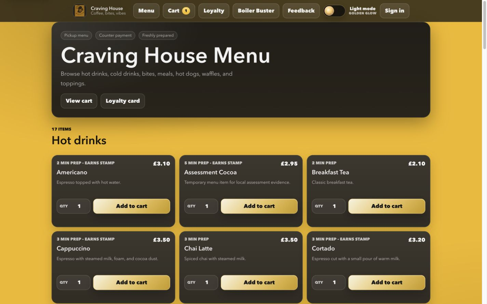
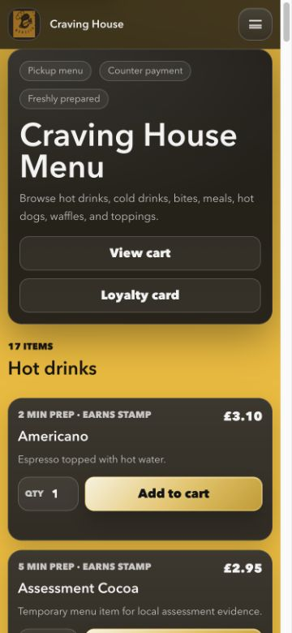

# Frontend Screenshot Evidence

Initial captures 01–17 were recorded on **17 September 2026** from the actual locally running Django application, using the Codex in-app browser and a disposable seeded SQLite database. The browser exports JPEG bytes, so the captured files use `.jpg` extensions. These are viewport screenshots, not generated illustrations. Follow-up capture 18 comes from Render after Stripe Sandbox payment; 19–20 show the corrected local menu. Demonstration contact details and loyalty code are synthetic/seeded. The local database is not included in the repository.

Desktop viewport: **1440 × 900**. Mobile viewport: **375 × 812**. A browser scrollbar may reduce captured content width. Long pages extend below the viewport. Screenshots show different stages of the same assessment session; for example, the order becomes Ready and the card increases to three stamps. They do not represent a single simultaneous database snapshot.

## Captured checklist

| Complete | File | Evidence / state |
| --- | --- | --- |
| [x] | [01-home-desktop.jpg](01-home-desktop.jpg) | Guest dashboard; corrected eight-stamp message; desktop actions. |
| [x] | [02-home-mobile.jpg](02-home-mobile.jpg) | Home at 375px with mobile toggle and stacked shortcuts. |
| [x] | [03-menu-desktop.jpg](03-menu-desktop.jpg) | Desktop category/card layout, including the temporary Assessment Cocoa item created during M19. |
| [x] | [04-menu-mobile.jpg](04-menu-mobile.jpg) | Mobile menu heading, cards and ordering controls. |
| [x] | [05-item-customisation.jpg](05-item-customisation.jpg) | Waffle disclosure open; Nutella +£1.10 selected. |
| [x] | [06-cart.jpg](06-cart.jpg) | Two waffles with Nutella, £12.80 total. |
| [x] | [07-checkout.jpg](07-checkout.jpg) | Guest details form/summary; unconfigured Stripe disabled. |
| [x] | [08-order-confirmation.jpg](08-order-confirmation.jpg) | Counter order after staff marked it Ready for collection. |
| [x] | [09-login-account.jpg](09-login-account.jpg) | Login fields and signup link. |
| [x] | [10-loyalty.jpg](10-loyalty.jpg) | Customer card, locally generated QR and three earned stamps. |
| [x] | [11-feedback.jpg](11-feedback.jpg) | Signed-in form uses seeded customer email. |
| [x] | [12-boiler-buster.jpg](12-boiler-buster.jpg) | Game interface in standby; gameplay is documented in M17. |
| [x] | [13-staff-dashboard.jpg](13-staff-dashboard.jpg) | Active order overview, status/payment counts and loyalty station. |
| [x] | [14-staff-order-management.jpg](14-staff-order-management.jpg) | Mobile order station, Ready state and update control. |
| [x] | [15-manager-menu-management.jpg](15-manager-menu-management.jpg) | Manager metrics and item actions. |
| [x] | [16-signup.jpg](16-signup.jpg) | Registration fields and Django password guidance. |
| [x] | [17-loyalty-mobile-after-stamps.jpg](17-loyalty-mobile-after-stamps.jpg) | Mobile customer card after staff awarded three stamps. |

## Follow-up captures

The initial set above is retained as historical evidence before the accessibility fixes. These additional captures show the follow-up states; dimensions below are the actual JPEG pixel dimensions, which can differ from CSS viewport dimensions because of the capture tool and scrollbars.

| File | Date / browser | Dimensions | Actual state |
| --- | --- | --- | --- |
| [18-stripe-sandbox-success.jpg](18-stripe-sandbox-success.jpg) | 17 September 2026; in-app browser | 1280 × 720 | Render return: £3.10 Payment successful after Sandbox card testing (F03). |
| [19-menu-contrast-desktop.jpg](19-menu-contrast-desktop.jpg) | 18 September 2026; in-app browser | 1425 × 891; requested viewport 1440 × 900 | Local guest menu after text/card contrast fixes. |
| [20-menu-contrast-mobile.jpg](20-menu-contrast-mobile.jpg) | 18 September 2026; in-app browser | 360 × 780; requested viewport 375 × 812 | Same corrected menu at mobile width. |

## Remaining manual evidence

- [ ] Successful physical QR scan and decoded code; real camera permission-denial feedback followed by manual entry.
- [ ] Physical touch gameplay on a named phone/tablet.
- [ ] Representative Chrome, Firefox and Edge captures with browser versions and the tested home/menu/cart/checkout states.
- [ ] Full screen-reader/zoom and remaining contrast verification.

Browser signup/history, keyboard game and Safari results are preserved as text snapshots in [testing evidence](../testing/README.md). Text observations are evidence of the listed interaction, not invented image files. The three [design wireframes](../../README.md#design) are labelled retrospective diagrams and kept separate from screenshots.
